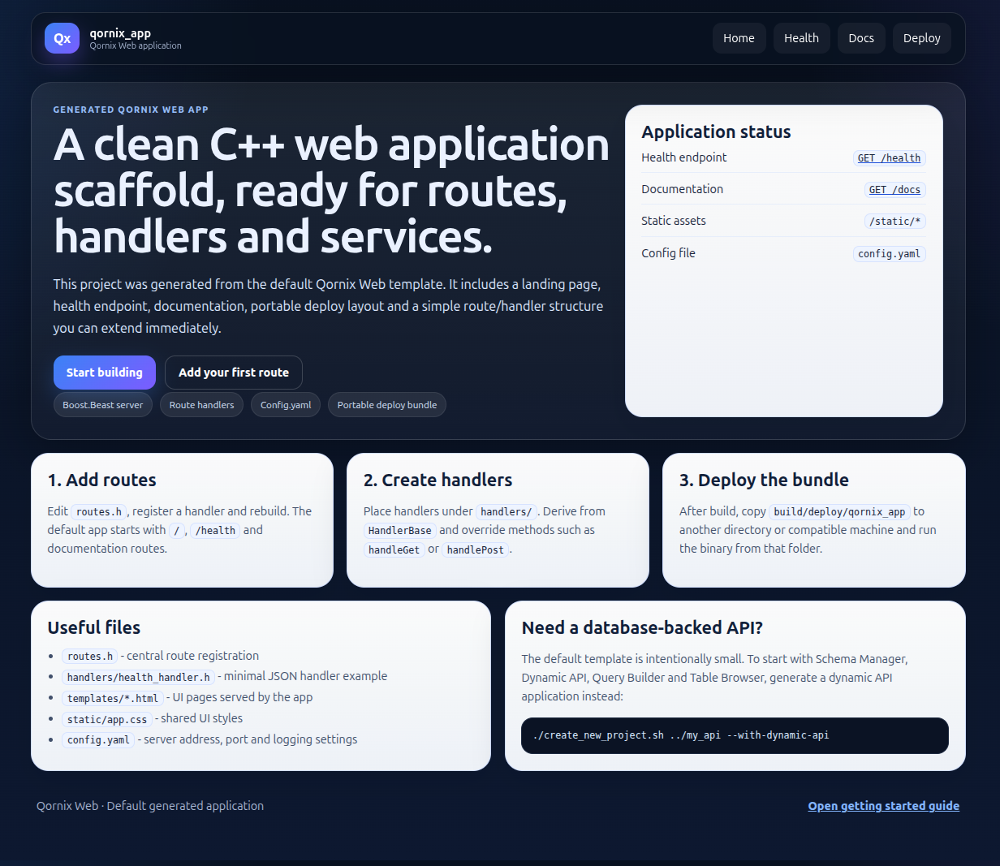
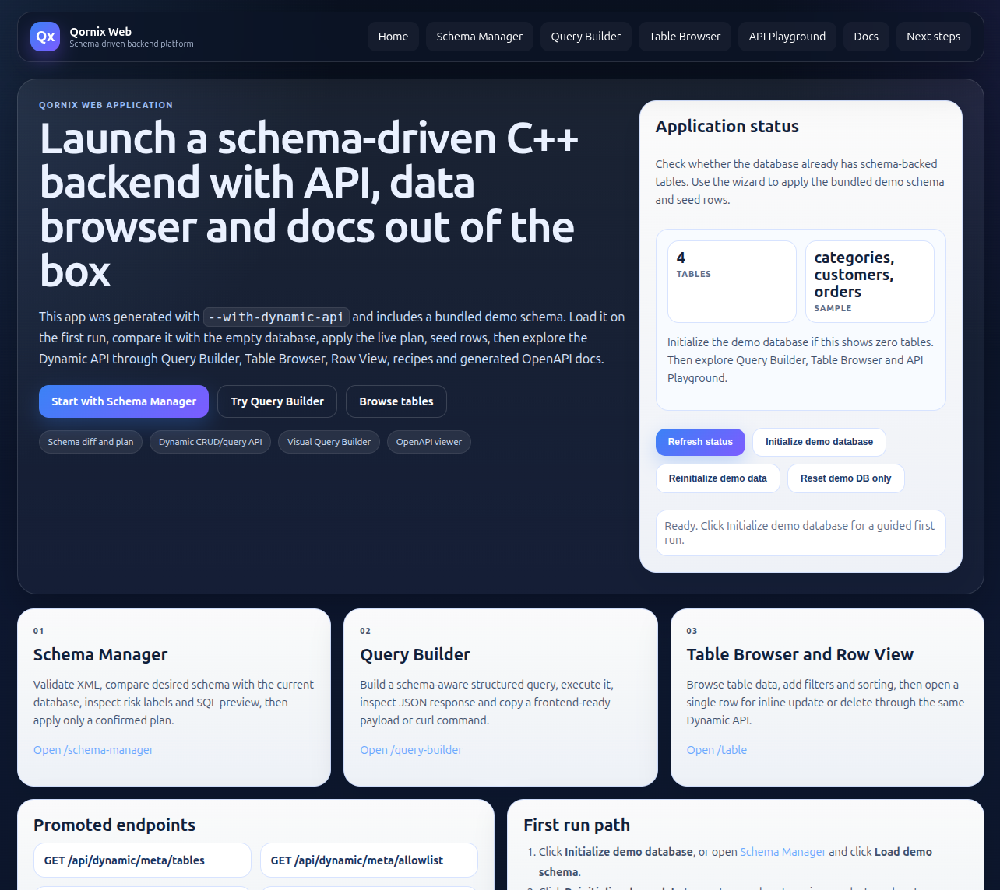

# Creating a new application based on Qornix Web

This guide describes the main scenarios for generating standalone applications based on Qornix Web.

## 1. Application templates

### Default application

Generate it with:

```bash
./create_new_project.sh ../my_app
```

It uses the template:

```text
templates/app
```

This is a minimal but already user-friendly C++ web application skeleton. Use it when you want to add routes, handlers, services, HTML pages and API endpoints yourself.

Generated default application preview:



The generated application includes:

- a landing page at `/`;
- a health endpoint at `/health`;
- an in-app documentation hub at `/docs`;
- getting started, routing, configuration and deployment documents;
- static asset serving through `/static/{filename}`;
- markdown document preview through `/docs/raw/{filename}`;
- a portable deploy bundle under `build/deploy/<app>`;
- `runtime-Dockerfile` for building a runtime image around the deploy bundle.

### Schema-driven Dynamic API application

Generate it with:

```bash
./create_new_project.sh ../my_api --with-dynamic-api
```

It uses the template:

```text
templates/dynamic_api_app
```

Use this variant when you need Schema Manager, Dynamic API, Query Builder, Table Browser, API Playground and a demo database out of the box.

Generated Dynamic API application preview:



### Schema-driven Dynamic API + Vue application

Generate it with:

```bash
./create_new_project.sh ../my_vue --with-dynamic-api-vue
```

Equivalent explicit template form:

```bash
./create_new_project.sh ../my_vue --template dynamic-api-vue
```

It uses the template:

```text
templates/dynamic_api_vue_app
```

Use this variant when you want a ready Dynamic API backend and a Vue/Vite frontend scaffold in the same generated project. The backend keeps the existing Dynamic API behavior, serves Vue at `/`, moves backend/admin pages under `/backend/*`, exposes `/backend-admin` as a frontend developer hub and builds the frontend into the deploy bundle during `cmake --build .`.

This is the recommended starting point when a backend developer wants to hand a working API environment to a frontend developer.

### Schema-driven Dynamic API + React application

Generate it with:

```bash
./create_new_project.sh ../my_react --with-dynamic-api-react
./create_new_project.sh ../my_angular --with-dynamic-api-angular
```

Equivalent explicit template form:

```bash
./create_new_project.sh ../my_react --template dynamic-api-react
./create_new_project.sh ../my_angular --template dynamic-api-angular
```

It uses the template:

```text
templates/dynamic_api_react_app
templates/dynamic_api_angular_app
```

Use this variant when you want a ready Dynamic API backend and a React/Vite frontend scaffold in the same generated project. The backend keeps the existing Dynamic API behavior, serves React at `/`, moves backend/admin pages under `/backend/*`, exposes `/backend-admin` as a frontend developer hub and builds the frontend into the deploy bundle during `cmake --build .`.

This is the recommended starting point when a backend developer wants to hand a working API environment to a frontend developer.

### RAG application

Generate it with:

```bash
./create_new_project.sh ../my_rag_app --template rag_app
```

Equivalent template aliases:

```bash
./create_new_project.sh ../my_rag_app --template rag-app
./create_new_project.sh ../my_rag_app --template rag
```

It uses the template:

```text
templates/rag_app
```

Use this variant when you want a full Qornix Web application with the reusable `qornix_rag` module embedded from the start. The generated application exposes the RAG UI at `/rag`, RAG APIs under `/api/rag/*`, local SQLite QA storage under `data/`, Markdown knowledge base files under `knowledge_base/`, and a deploy bundle under `build/deploy/<app>`.

The generated application is configured through its own `config.yaml`. It does not use the standalone-only `qornix_rag/run.sh` launcher or the standalone `qornix_rag/config.yaml`.

## 2. Recommended workspace structure

A new application does not copy framework sources into itself. It links `qornix_web` through CMake.

```text
workspace/
├── qornix_web/
└── my_app/
```

## 3. Creating a default application

```bash
cd qornix_web
./create_new_project.sh ../my_app
```

After generation:

```bash
cd ../my_app
mkdir -p build
cd build
cmake ..
cmake --build .
```

Run from the deploy bundle:

```bash
cd deploy/my_app
./my_app
```

Open:

```text
http://127.0.0.1:8008/
http://127.0.0.1:8008/docs
http://127.0.0.1:8008/health
```

## 4. Default application structure

```text
my_app/
├── CMakeLists.txt
├── README.md
├── config.yaml
├── main.cpp
├── routes.h
├── app_paths.h
├── runtime-Dockerfile
├── handlers/
│   ├── health_handler.h
│   └── page_handlers.h
├── templates/
│   ├── index.html
│   ├── docs.html
│   └── 404.html
├── static/
│   └── style.css
├── doc/
│   ├── getting_started.md
│   ├── routing_and_handlers.md
│   ├── configuration.md
│   └── deployment.md
├── route_extensions/
└── logs/
```

## 5. What `create_new_project.sh` does

The script:

1. validates the project name;
2. chooses the template: `templates/app`, `templates/dynamic_api_app`, `templates/dynamic_api_vue_app`, `templates/dynamic_api_react_app` or `templates/dynamic_api_angular_app`;
3. copies the template to the new directory;
4. substitutes `@PROJECT_NAME@`, `@PROJECT_NAME_UPPER@` and `@QORNIX_WEB_ROOT@`;
5. creates the `logs` directory;
6. does not copy framework sources into the application;
7. includes `runtime-Dockerfile`;
8. prints build commands, run commands, the deploy bundle path and Docker image commands.

## 6. Generator options

| Option | Template | Description |
|--------|----------|-------------|
| no option | `templates/app` | Default C++ web application. |
| `--with-dynamic-api` | `templates/dynamic_api_app` | Dynamic API backend/admin application. |
| `--with-dynamic-api-vue` | `templates/dynamic_api_vue_app` | Dynamic API backend plus Vue/Vite frontend. |
| `--with-dynamic-api-react` | `templates/dynamic_api_react_app` | Dynamic API backend plus React/Vite frontend. |
| `--with-dynamic-api-angular` | `templates/dynamic_api_angular_app` | Dynamic API backend plus Angular frontend. |
| `--template app` or `--template default` | `templates/app` | Explicit default template. |
| `--template dynamic-api` | `templates/dynamic_api_app` | Explicit Dynamic API template. |
| `--template dynamic-api-vue` | `templates/dynamic_api_vue_app` | Explicit Dynamic API + Vue template. |
| `--template dynamic-api-react` | `templates/dynamic_api_react_app` | Explicit Dynamic API + React template. |
| `--template dynamic-api-angular` | `templates/dynamic_api_angular_app` | Explicit Dynamic API + Angular template. |

The Vue and React templates require `npm` during CMake build. The generated frontend can also be developed with the normal Vite workflow from the `frontend/` directory.

## 7. Portable deploy bundle

The default template creates the deploy bundle automatically after building the executable:

```text
build/deploy/my_app/
├── my_app
├── config.yaml
├── templates/
├── static/
├── doc/
└── logs/
```

To move the application to another directory, copy the entire bundle:

```bash
cp -a build/deploy/my_app /opt/my_app
cd /opt/my_app
./my_app
```

If the binary is not launched from the bundle root, pass the root explicitly:

```bash
QORNIX_APP_ROOT=/opt/my_app /opt/my_app/my_app
```

## 8. Runtime Docker image

Generated applications include `runtime-Dockerfile`. It does not build the C++ app; it copies the already assembled deploy bundle into an Ubuntu 24.04 runtime image.

Build the app and image:

```bash
mkdir -p build
cmake -S . -B build
cmake --build build --target my_app_deploy
docker build -f runtime-Dockerfile -t my_app:runtime .
```

Run with the config embedded in the image:

```bash
docker run --rm -p 8008:8008 my_app:runtime
```

For editable config and persistent runtime files:

```bash
mkdir -p docker/config data logs
cp build/deploy/my_app/config.yaml docker/config/config.yaml
```

For a Dynamic API app, set container paths in `docker/config/config.yaml`:

```yaml
server:
  address: 0.0.0.0
  port: 8008
logging:
  to_file: true
  file_path: /logs/server
database:
  driver: sqlite
  path: /data/app.sqlite3
dynamic_api:
  schema:
    file: /data/schema/app.schema.xml
    exported_file: /data/schema/database.schema.xml
    history_file: /data/schema/schema_history.jsonl
```

Run with bind mounts:

```bash
docker run -d --name my_app \
  -p 8008:8008 \
  -v "$PWD/docker/config/config.yaml:/app/config.yaml:ro" \
  -v "$PWD/data:/data" \
  -v "$PWD/logs:/logs" \
  my_app:runtime
```

To move the application to another computer without a registry:

```bash
docker save my_app:runtime -o my_app-runtime.tar
```

Copy `my_app-runtime.tar`, `docker/config/config.yaml` and `data/` if the app uses local SQLite/schema state. On the target machine:

```bash
docker load -i my_app-runtime.tar
docker run -d --name my_app -p 8008:8008 \
  -v "$PWD/docker/config/config.yaml:/app/config.yaml:ro" \
  -v "$PWD/data:/data" \
  -v "$PWD/logs:/logs" \
  my_app:runtime
```

## 9. Runtime dependencies

The deploy bundle contains the binary, config, templates, static assets and documentation. It does not include system shared libraries.

Check dependencies:

```bash
ldd build/deploy/my_app/my_app
```

A target machine must provide compatible versions of the runtime libraries used during build.

The runtime Docker image installs the expected Ubuntu 24.04 runtime packages. If you enable additional modules or database drivers, inspect dependencies with `ldd build/deploy/my_app/my_app` and update `runtime-Dockerfile`.

## 10. Adding an endpoint

Create a handler, for example `handlers/hello_handler.h`, inherit it from `HandlerBase`, then register it in `routes.h`:

```cpp
server.add_route("GET", "/hello", std::make_shared<HelloHandler>());
```

See the generated application for details:

```text
handlers/health_handler.h
routes.h
```

## 11. Enabling ORM and JWT

ORM is disabled by default in the default template:

```bash
cmake .. -DMY_APP_ENABLE_ORM=ON
```

JWT is also disabled by default:

```bash
cmake .. -DMY_APP_ENABLE_JWT=ON
```

Auth is enabled by default through the `MY_APP_ENABLE_AUTH` option.

## 12. If the framework was moved

You can override the path to `qornix_web` during configuration:

```bash
cmake .. -DQORNIX_WEB_ROOT=/path/to/qornix_web
```

## Async template guidance

The default template now includes async HTTP route examples by default. After generation, check:

```text
/async/ping
/async/sleep/10
```

The Dynamic API template enables `QORNIX_ENABLE_ASYNC_DB=ON` and contains async DB configuration notes. SQLite uses the explicit sync-offloaded adapter for local demos; PostgreSQL/MySQL require the corresponding async backend CMake flags and live configuration.
